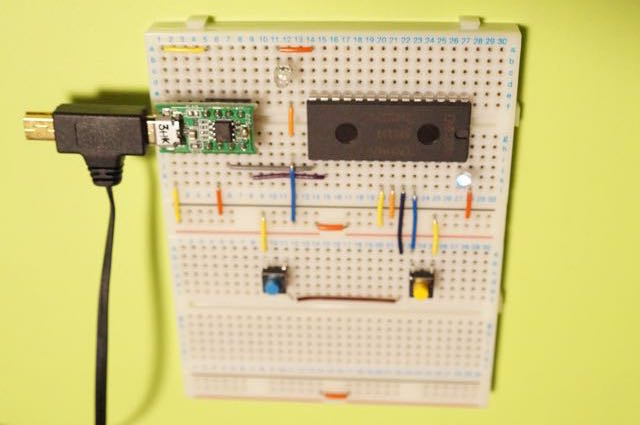
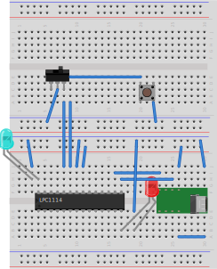
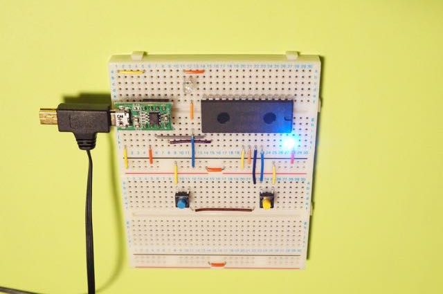
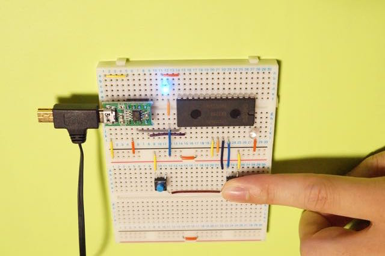

lpc1114_app: 01_blink
=====================

概要
----
配線数を極力少なくして、プロセッサらしい振る舞いをするようにタイマに
を使ったLED点滅コードを実行する。動作確認を少ない手順で出来るように
して、確認できた状態に少しずつ変更を加えるようにする。

準備(Windows)
------------
- Windows PC
- LPC1114
-　ブレッドボード部品セット
-- ブレッドボードx2
-- タクトスイッチx2
-- LED (ブレッドボード部品セット付属のものだと故障するかも?)
-- USBシリアル変換モジュール MPL2303SA (SJ1,SJ2のジャンパーをショートしたもの)

TODO: ドライバ、FlashMagicなど、インストールするものを列挙。

手順: 回路作成
------------
1.ブレッドボード上で配線。以下、繋ぐピンの表。

|ピン1|ピン2|
|----|----|
|USBシリアル変換モジュールのGND(1ピン)|ブレッドボードの+|
|USBシリアル変換モジュールのVO_33(8ピン)|ブレッドボードの -|
|USBシリアル変換モジュールのTXD(2ピン)|LPC1114のRXD(15ピン)|
|USBシリアル変換モジュールのRXD(4ピン)|LPC1114のTXD(16ピン)|
|LPC1114の21ピン|ブレッドボードの+|
|LPC1114の22ピン|ブレッドボードの-|
|リセット用タクトスイッチ 青 |LPC1114の23ピンとブレッドボードの-|
|汎用タクトスイッチ 黄色 (ISPモード移行に使用)|LPC1114の24ピンとブレッドボードの-|
|LED1(Lチカ確認用)|LPC1114の14ピンとブレッドボードの+|
|LED2(Lチカ確認用)|LPC1114の28ピンとブレッドボードの-|

[Graphvizで無理やり表現してみたもの](image/dot_circuit.png)

手順: プログラムの書込み
--------------------
2. PCとUSBシリアル変換モジュールをmicro USBケーブルでつなぐ。
3. 汎用タクトスイッチを押した状態で、リセット用タクトスイッチを押してはなす。(ISPモードに以降する)LED2がうっすらと点灯する?
4. (COMポートを確認)
5. PCでFlashMagicを起動し、以下のように設定する。
- chip: LPC1114/122
- COM Port: 確認したCOMポート
- hexファイル: c:\workspace\sw_led_test\Debug\sw_led_test.hex 
- Erase blocks used by Hex Fileにチェック
- Verify after programmingにチェック
- Fill unused Flashにチェック
6. FlashMagicのStartボタンをおす。 FlashMagicの左下にFinishedと表示されたらプログラムの書き込みが成功している。

手順: 動作確認
------------
7. リセット用タクトスイッチをおす。LED2が強く点灯し、LED1は消灯する。

8. 汎用スイッチをおす。LED2が消灯し、LED1が点灯する。

手順: プログラムのコンパイル
-----------------------
- (sw_led_testとCMSISv2p00_LPC11xxのプロジェクトをインポート)
- (sw_led_testからCMSISv2p00_LPC11xxの依存関係を設定する。)
- (Xpresso IDEでsw_led_testをビルド。 )

手順: プログラムの修正
------------------
(タイマーを利用するように書き換える)

TODO
----
- 説明を追加
- ソースを追加
- 写真がぼけているのを...
- LEDのところに抵抗をいれる?

参考
---
- [フィジコン入門 - LPC1114ミニマム開発キット（ハードウェア編）](http://fukuno.jig.jp/393)
- [LPCマイコンを使ってみる(タイマ編その1)](http://blog.livedoor.jp/juggleryou/archives/5880385.html)

増山隆 < mamewotoko@gmail.com >
